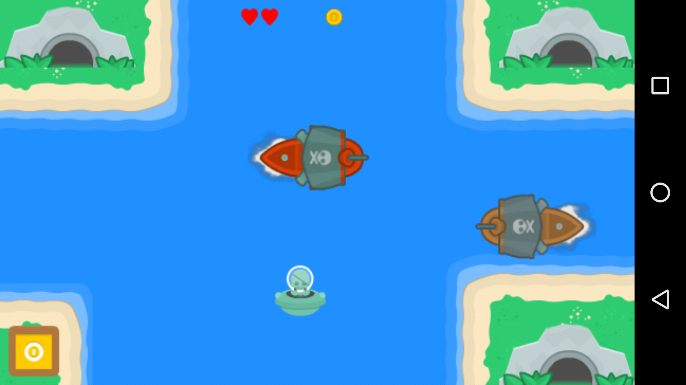

NDK Pirate Game
==============
Greetings!

This is very basic NDK + OpenGL ES 2.0 game project created for learn purposes.

Current gameplay: steal gold from pirate caves and store in your box.
(3 collected coins increase difficulty level and need to be taken from each cave)

TODO: Turn on slot feature, review source code, update assets, extend gameplay add tutorial;

Pre-requisites
--------------
- Android Studio 3.0+
- Please remember to download cmake to SDK manually

Screenshots
-----------

License
-------
Music from:
Soundimage.org
Free Music, Sound Effects and Images for Your Projects by Eric Matyas.
http://soundimage.org/funnyquirky/

Graphics from:
Game assets pack
https://kenney.nl/assets

Engine creation based on:
Android NDK: Beginner's Guide - Second Edition
By Sylvain Ratabouil
April 2015
ISBN 9781783989645

libpng license included with source code